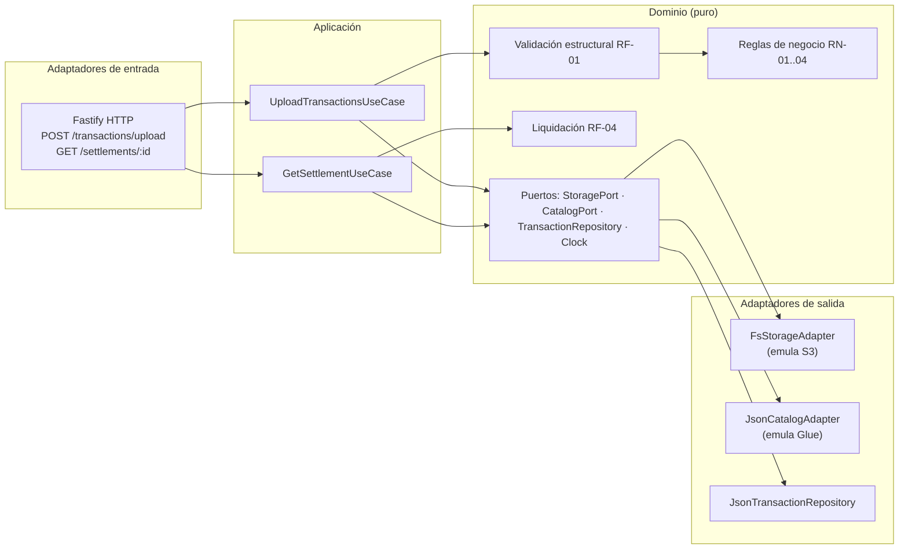

# FinCard — Módulo de Liquidación de Puntos y Aliados

API para carga y validación de transacciones de puntos de aliados comerciales, con almacenamiento tipo S3, catalogación tipo Glue y reportes de liquidación.

**🌐 Demo desplegada en AWS (EC2 + ECR, us-east-2):** http://3.134.76.128
```bash
curl http://3.134.76.128/health
curl -F "file=@data/sample-transactions.csv" http://3.134.76.128/api/v1/transactions/upload
curl "http://3.134.76.128/api/v1/settlements/PART01?from=2026-07-01&to=2026-07-05"
```

**Stack:** Node.js 20+ · TypeScript (strict) · Fastify 5 · Vitest · Docker

## Ejecución local

```bash
npm install
npm run dev          # levanta el API en http://localhost:3000
npm test             # ejecuta la suite de pruebas
```

Con Docker:

```bash
docker build -t fincard-loyalty .
docker run -p 3000:3000 fincard-loyalty
```

### Probar el flujo completo

```bash
# 1. Cargar el CSV de ejemplo (incluye casos borde: filas inválidas y flageadas)
curl -F "file=@data/sample-transactions.csv" \
  http://localhost:3000/api/v1/transactions/upload

# 2. Consultar la liquidación de un aliado
curl "http://localhost:3000/api/v1/settlements/PART01?from=2026-07-01&to=2026-07-31"
```

Tras una carga, los artefactos de emulación quedan en `data/`:

| Artefacto | Emula | Ruta |
|---|---|---|
| Archivos por partición | Amazon S3 | `data/s3/fincard-transactions/{year}/{month}/{partner_id}/` |
| Manifest por batch | S3 (metadatos) | `data/s3/fincard-transactions/_manifests/{batch_id}.json` |
| Catalogación | AWS Glue Data Catalog | `data/glue-catalog.json` |
| Transacciones + flageadas | Base analítica | `data/db.json` |

## Arquitectura

Arquitectura **Hexagonal (Ports & Adapters)**. El dominio (validaciones, reglas de negocio RN-01…RN-04, cálculo de liquidación) es TypeScript puro sin dependencias de framework ni de AWS; los casos de uso orquestan; la infraestructura implementa los puertos.



**Por qué hexagonal aquí:** el enunciado pide emular S3/Glue en local pero usar los SDK reales en producción. Con puertos, ese cambio es *solo* escribir un `S3StorageAdapter` y un `GlueCatalogAdapter` con `@aws-sdk/client-s3` / `@aws-sdk/client-glue` y cambiar el wiring de `main.ts` — cero cambios en dominio, casos de uso o tests de negocio. Además el dominio puro permite testear las reglas de negocio sin infraestructura.

### Estructura

```
src/
├── domain/          # Modelos, puertos, validación, reglas RN-01..04, liquidación
├── application/     # Casos de uso (orquestación)
├── infrastructure/  # Adapters: filesystem-S3, JSON-Glue, repositorio JSON, reloj
└── http/            # Fastify: servidor y rutas (adapter de entrada)
tests/               # Vitest: unitarias de dominio + caso de uso con dobles en memoria
queries/             # optimization.sql (Redshift + Athena + anomalías)
docs/adr/            # Architecture Decision Records
docs/DESIGN.md       # Pipeline ETL/ELT, arquitectura objetivo AWS y seguridad
data/reference/      # Datos de referencia: aliados y miembros
infra/               # Terraform: App Runner + ECR (IaC)
```

## Reglas de negocio implementadas (RF-05)

| Regla | Comportamiento |
|---|---|
| RN-01 | Neto > 10.000 puntos/miembro/día → transacciones excedentes a `transactions_flagged` |
| RN-02 | > 30% de transacciones diarias de un aliado con redención → redenciones excedentes flageadas |
| RN-03 | > 5 transacciones/miembro/aliado/día → las adicionales flageadas |
| RN-04 | Fecha futura o > 2 años atrás → flageada |

Las transacciones flageadas se persisten con su motivo y **no** participan en la liquidación.

## Supuestos documentados

1. **400 con procesamiento parcial:** si el archivo tiene filas inválidas, el API responde `400` con el detalle por fila (RF-01) pero las filas válidas del mismo archivo sí se procesan y quedan registradas en el manifest (RF-02 exige contar válidas y rechazadas). Ver ADR-003.
2. **Duplicados**: la unicidad de `transaction_id` se valida *dentro del archivo* (lo que pide RF-01); la deduplicación histórica entre batches sería el paso siguiente natural.
3. **RN-02**: cuando un aliado excede el 30% de redenciones diarias se flagean las redenciones *excedentes* en orden de llegada (no todas las del día), preservando las que sí caben en el umbral.
4. **Prioridad de reglas**: RN-04 → RN-01 → RN-03 → RN-02; una transacción se flagea una sola vez y deja de contar para las reglas siguientes.

## Seguridad

Validación estricta de toda entrada (regex por campo, fechas de calendario reales), límite de 20 MB y 1 archivo por request, rechazo de archivos no-CSV, errores de negocio sin stack traces al cliente, contenedor no-root y hash SHA-256 de cada archivo para integridad. Detalle y roadmap de producción (auth por aliado, rate limiting, KMS) en [docs/DESIGN.md](docs/DESIGN.md).

## Tecnologías

- **Fastify 5** — framework HTTP requerido; `@fastify/multipart` para el upload.
- **csv-parse** — parsing CSV robusto (BOM, quoting, líneas vacías).
- **Vitest** — 25+ pruebas unitarias y de caso de uso.
- **Sin base de datos externa** — persistencia JSON local intercambiable por puerto (ADR-002).

## Entregables

- [x] API Fastify + TypeScript con RF-01…RF-05
- [x] Emulación S3 (manifest con SHA-256) y Glue Data Catalog
- [x] Tests automatizados de reglas de negocio
- [x] `queries/optimization.sql` (Redshift, Athena, costos, particionamiento, anomalías)
- [x] ADRs en `docs/adr/`
- [x] Dockerfile multi-stage
- [x] IaC: Terraform para AWS App Runner + ECR en [infra/](infra/)
- [x] Desplegado en AWS: imagen en ECR ejecutándose en EC2 (us-east-2) — http://3.134.76.128
