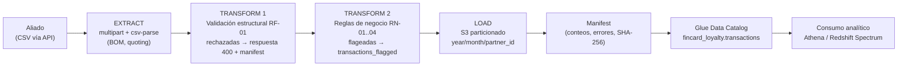
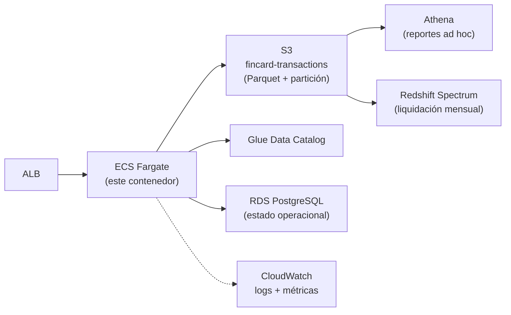

# DESIGN.md — FinCard: Liquidación de Puntos y Aliados

Complementa el README con el diseño del pipeline de datos, la arquitectura objetivo en AWS y las consideraciones de seguridad.

## 1. Diseño del pipeline ETL/ELT

El flujo de carga implementado **es** un pipeline ETL con validación en línea (el requerimiento del negocio: pasar de liquidaciones de 72 h a validación en tiempo real):

Decisiones de pipeline:

- **Validar antes de cargar (ETL, no ELT) para el flujo transaccional**: el aliado necesita feedback inmediato de calidad de dato (razón de ser del proyecto). Los datos "sucios" no contaminan la zona analítica: las filas rechazadas solo quedan descritas en el manifest y las flageadas van a una tabla separada.
- **Particionamiento desde la escritura**: los archivos se escriben ya particionados por `year/month/partner_id`, de modo que la zona analítica queda lista para consultas baratas (ver `queries/optimization.sql`, sección 2.c).
- **Manifest por batch**: cada carga es auditable (conteos, errores por fila, SHA-256 del original, timestamp). Esto habilita reprocesos idempotentes y trazabilidad ante disputas con aliados.
- **Catalogación como paso del pipeline**: el catálogo (Glue) se actualiza en la misma operación, evitando el clásico desfase "hay datos en S3 que Athena no ve".
- **Evolución a ELT para históricos**: para migraciones masivas (backfills), el mismo dominio se reutiliza en un job batch (Glue Job/Step Functions) que lee crudos desde un bucket de staging, aplica idénticas reglas (mismo código de dominio) y escribe Parquet. El diseño hexagonal permite ese segundo "driving adapter" sin tocar la lógica.

## 2. Arquitectura objetivo en AWS (no desplegada; diseño propuesto)

- El contenedor del Dockerfile corre igual en ECS Fargate; solo cambia el wiring de `main.ts` a adapters `@aws-sdk/client-s3` y `@aws-sdk/client-glue`.
- IaC sugerida: Terraform (módulos: red, ECS, S3+lifecycle, Glue, IAM). No se incluyó por alcance de tiempo; el diseño por puertos deja los contratos listos.
- IAM por rol de tarea con mínimo privilegio: `s3:PutObject` restringido al prefijo del bucket, `glue:UpdateTable` sobre la base `fincard_loyalty` únicamente.

## 3. Seguridad de la aplicación

Implementado en esta entrega:

| Medida | Dónde |
|---|---|
| Validación estricta de entrada (regex por campo, tipos, fechas reales) | `src/domain/validation.ts` |
| Límite de tamaño de archivo (20 MB) y de cantidad (1 por request) | `src/http/server.ts` (@fastify/multipart) |
| Rechazo de archivos no-CSV por extensión y MIME | `src/http/routes/transactions.route.ts` |
| Sin construcción dinámica de rutas desde input del usuario: `partner_id`/fecha ya validados por regex antes de tocar el filesystem | dominio + adapters |
| Errores controlados: el detalle interno no se filtra al cliente (mensajes de negocio, no stack traces) | rutas + casos de uso |
| Contenedor como usuario no root, imagen multi-stage sin devDependencies | `Dockerfile` |
| Hash SHA-256 del archivo original para integridad/no repudio | manifest (RF-02) |

Pendiente para producción (documentado como roadmap): autenticación de aliados (JWT/OAuth2 client-credentials por aliado), rate limiting (`@fastify/rate-limit`), TLS terminado en ALB, cifrado en reposo (SSE-KMS en S3), y escaneo de dependencias en CI (npm audit / Dependabot).

## 4. Nota sobre net_points_owed negativo

RF-04 exige reportar `net_points_owed = 0` cuando el neto es negativo, manteniendo el valor real internamente. `buildSettlement()` (dominio) retorna ambos: `summary.net_points_owed` (clamp a 0) e `internal_net_points` (valor real, cubierto por test). La capa HTTP solo expone el primero; el segundo queda disponible para conciliación interna.
